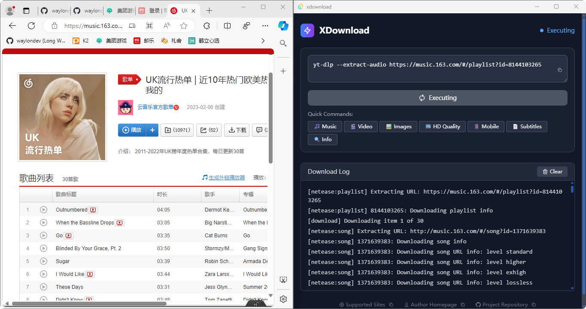
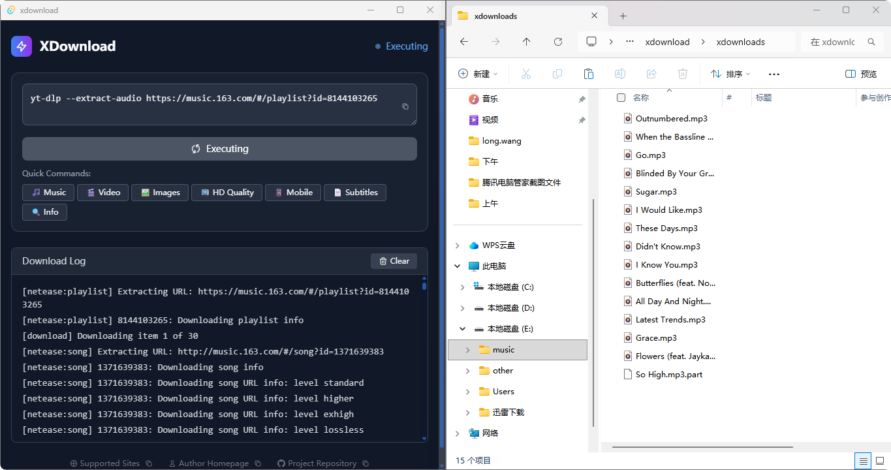

# XDownload - Minimalist Download Tool

## Introduction

XDownload is a minimalist download tool built with Rust + Tauri, focused on media content downloading.

## Demo




## Features

- ✅ Supports major video platforms (Bilibili, YouTube, NetEase Music, etc.)
- ✅ One-click quick commands, no need to remember complex parameters
- ✅ Automatically saves to `xdownloads` folder in current directory
- ✅ Cross-platform support (Windows/macOS/Linux)
- ✅ Minimalist interface, focused on download functionality

## Quick Start

### Prerequisites

Before using XDownload, you need to install yt-dlp:

**Windows:**
```bash
# Using winget (recommended)
winget install yt-dlp

# Or download from GitHub and add to PATH
# https://github.com/yt-dlp/yt-dlp/releases
```

**macOS:**
```bash
# Using Homebrew
brew install yt-dlp
```

**Linux:**
```bash
# Using pip
pip install yt-dlp

# Or using package manager (Ubuntu/Debian)
sudo apt install yt-dlp
```

### Optional: Install FFmpeg (for video merging)

For best experience with video downloads, install FFmpeg:

**Windows:**
```bash
winget install ffmpeg
```

**macOS:**
```bash
brew install ffmpeg
```

**Linux:**
```bash
# Ubuntu/Debian
sudo apt install ffmpeg

# CentOS/RHEL
sudo yum install ffmpeg
```

### Install Dependencies

```bash
pnpm install
```

### Development Mode

```bash
pnpm tauri dev
```

### Build Release

```bash
pnpm tauri build
```

## Usage

### Quick Commands

The app includes built-in download commands for instant use:

- 🎵 **Music** - Download audio (NetEase Music example)
- 🎬 **Video** - Download video (Bilibili example)
- 🖼️ **Images** - Download thumbnails
- 📺 **HD Quality** - HD download (YouTube example)
- 📱 **Mobile** - Mobile optimized download
- 📄 **Subtitles** - Download subtitles
- 🔍 **Info** - View video format information

### Custom Commands

Enter any `yt-dlp` command in the input box, supporting all yt-dlp parameters and features.

## Tech Stack

- **Backend**: Rust + Tauri
- **Frontend**: React + TypeScript + Tailwind CSS
- **Download Engine**: yt-dlp

## Download Path

All downloaded content is automatically saved to the `xdownloads` folder in the current working directory.

## Troubleshooting

For detailed usage instructions and troubleshooting, please refer to the [yt-dlp documentation](https://github.com/yt-dlp/yt-dlp).

Common issues:
- Ensure yt-dlp is installed and in system PATH
- Some platforms (like Douyin) may require cookies for download
- FFmpeg is recommended for video merging operations

## Release

### Automated Release Process

XDownload uses GitHub Actions for automated builds and releases. Simply push a version tag to automatically create a release:

1. **Commit code changes**
   ```bash
   git add .
   git commit -m "Release v1.0.0"
   ```

2. **Create and push version tag**
   ```bash
   # Create semantic version tag
   git tag v1.0.0
   
   # Push tag to trigger automated build
   git push origin v1.0.0
   ```

3. **Monitor build status**
   - Check GitHub Actions page for build progress
   - Download Windows installer from Releases page after build completes

### Build Artifacts

Automated builds generate the following Windows installers:
- `xdownload_1.0.0_x64-setup.exe` - Windows installer
- `xdownload_1.0.0_x64.msi` - Windows MSI package

### Manual Build (Development)

For local testing and building:
```bash
# Install dependencies
pnpm install

# Build application
pnpm tauri build

# Build files located at
# src-tauri/target/release/bundle/
```

## License

MIT License