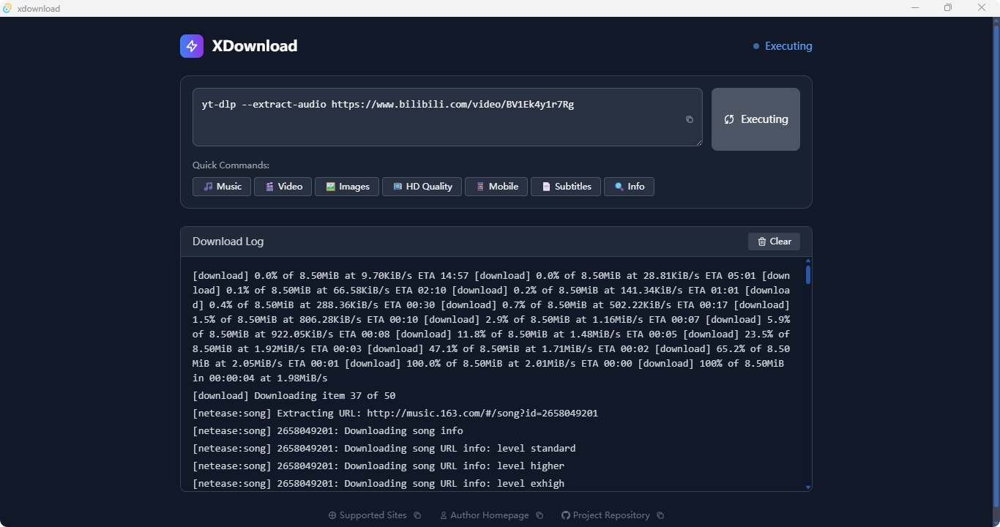
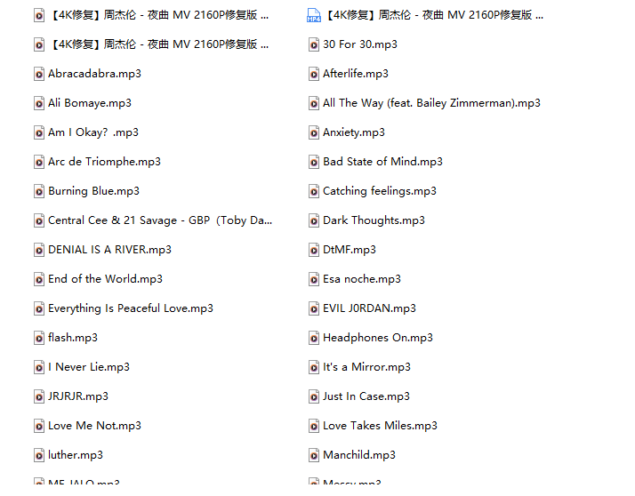

# XDownload - Minimalist Download Tool

## Introduction

XDownload is a minimalist download tool built with Rust + Tauri, focused on media content downloading.

## Demo




## Features

- ✅ Supports major video platforms (Bilibili, YouTube, NetEase Music, etc.)
- ✅ One-click quick commands, no need to remember complex parameters
- ✅ Automatically saves to `xdownloads` folder in current directory
- ✅ Cross-platform support (Windows/macOS/Linux)
- ✅ Minimalist interface, focused on download functionality

## Quick Start

### Install Dependencies

```bash
pnpm install
```

### Development Mode

```bash
pnpm tauri dev
```

### Build Release

```bash
pnpm tauri build
```

## Usage

### Quick Commands

The app includes built-in download commands for instant use:

- 🎵 **Music** - Download audio (NetEase Music example)
- 🎬 **Video** - Download video (Bilibili example)
- 🖼️ **Images** - Download thumbnails
- 📺 **HD Quality** - HD download (YouTube example)
- 📱 **Mobile** - Mobile optimized download
- 📄 **Subtitles** - Download subtitles
- 🔍 **Info** - View video format information

### Custom Commands

Enter any `yt-dlp` command in the input box, supporting all yt-dlp parameters and features.

## Tech Stack

- **Backend**: Rust + Tauri
- **Frontend**: React + TypeScript + Tailwind CSS
- **Download Engine**: yt-dlp

## Download Path

All downloaded content is automatically saved to the `xdownloads` folder in the current working directory.

## License

MIT License